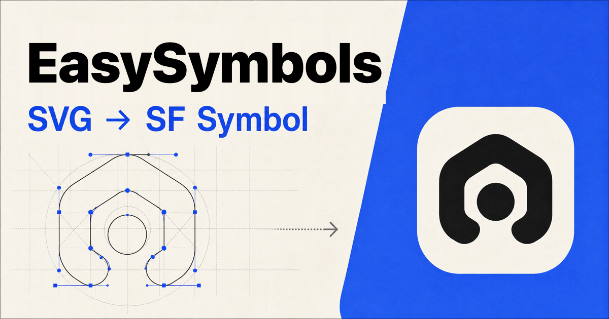

# EasySymbols

[](https://github.com/icodesign/easysymbols/actions/workflows/ci.yml)

Convert SVG artwork into Apple Custom SF Symbol templates.

<p align="center">
  
</p>

EasySymbols runs locally. Use the browser app for one-off conversions or the
CLI for repeatable builds and asset collections.

Website (Free): [https://easysymbols.rootstudio.io/](https://easysymbols.rootstudio.io/)

## Features

- Deterministic Apple Template v3 SVG output
- Preserves authored weight and scale masters
- Synthesizes 9 weights × 3 optical scales for compatible centerline artwork
- Detects and configures Hierarchical, Palette, and Multicolor layer annotations
- Exports `.symbols.svg`, `.symbolset`, `.xcassets`, and Swift packages
- Structural and pixel-level validation
- Optional Xcode asset-compiler validation on macOS

### Input and output

| Input                      | Default behavior                                                  |
| -------------------------- | ----------------------------------------------------------------- |
| Explicit SF master groups  | Preserve authored masters                                         |
| Stroke-only centerline SVG | Generate the full 27-master matrix when compatible                |
| Filled or mixed artwork    | Keep `Regular-M`; optionally generate approximate `S/M/L` masters |

## Quick start

Requirements: [Bun](https://bun.sh/) 1.3.14 or newer. The CLI also supports
Node.js 20.19 or newer.

### Web app

```bash
bun run dev
```

Open [http://localhost:3000](http://localhost:3000), then drop an SVG file or
paste SVG source. The app converts artwork in the browser and can download a
portable symbol SVG or an `.xcassets` Assets ZIP.

### CLI

Build the CLI with `bun run build`, then run it from the repository:

```bash
# Inspect an SVG
bun apps/cli/dist/main.js analyze icon.svg

# Write a custom symbol template
bun apps/cli/dist/main.js convert icon.svg \
  --name app-status \
  --output AppStatus.symbols.svg

# Write an individual .symbolset
bun apps/cli/dist/main.js convert icon.svg \
  --format symbolset \
  --output AppStatus.symbolset

# Validate a generated template
bun apps/cli/dist/main.js validate AppStatus.symbols.svg
```

Use `-` as the input or output path to work with stdin and stdout.

### Collections

Create a manifest with SVG paths relative to the manifest file:

```json
{
  "version": 1,
  "name": "RadixSymbols",
  "symbols": [
    { "name": "check", "source": "./radix-icons/check.svg" },
    { "name": "calendar", "source": "./radix-icons/calendar.svg" }
  ]
}
```

Export an asset catalog or a Swift package:

```bash
bun apps/cli/dist/main.js collection RadixSymbols.json \
  --format xcassets \
  --output RadixSymbols.xcassets

bun apps/cli/dist/main.js collection RadixSymbols.json \
  --format swift-package \
  --output RadixSymbols \
  --force
```

Run `bun apps/cli/dist/main.js --help` for all conversion and synthesis
options.

## Supported SVG

Supported inputs include paths, common basic shapes, nested transforms, local
styles, flat fills, solid strokes, and local gradients. Existing Apple rendering
classes are recognized. Literal colors and nonzero partial opacity become
reviewable Multicolor and Hierarchical layer suggestions in the web app; they
are never enabled without user approval. Monochrome rendering remains solid,
and fully opaque gradients are flattened with a warning because stops, colors,
and direction cannot be preserved.

The converter rejects text, images, `<use>`, external references, patterns,
clipping, masks, filters, dashed strokes, and transparent or unresolved
gradients instead of silently dropping geometry.

### Rendering semantics

EasySymbols follows Apple's [custom symbol rendering annotations](https://developer.apple.com/documentation/uikit/creating-custom-symbol-images-for-your-app):

- **Monochrome** uses one tint for every layer.
- **Hierarchical** assigns an opacity level with
  `hierarchical-<layer index>:primary|secondary|tertiary`.
- **Palette** reuses those hierarchy annotations, letting the caller provide
  primary, secondary, and tertiary colors.
- **Multicolor** assigns an intrinsic color role with
  `multicolor-<layer index>:<color name>`.

When a layer editor color is a custom HEX value, the downloadable `.xcassets`
archive includes a matching `.colorset` so the exact color survives in Xcode.
The standalone SVG uses the nearest Apple system color token instead, because a
bare SVG has no asset catalog in which a custom color name can be resolved.

## Contributing

Issues and focused pull requests are welcome. Changes to conversion behavior
should include a fixture or test that makes the expected output explicit.

EasySymbols generates custom templates; it does not extract or redistribute
Apple's system symbols.

## License

Copyright (c) 2026 Lance Wang (icodesign). See [LICENSE](LICENSE).
